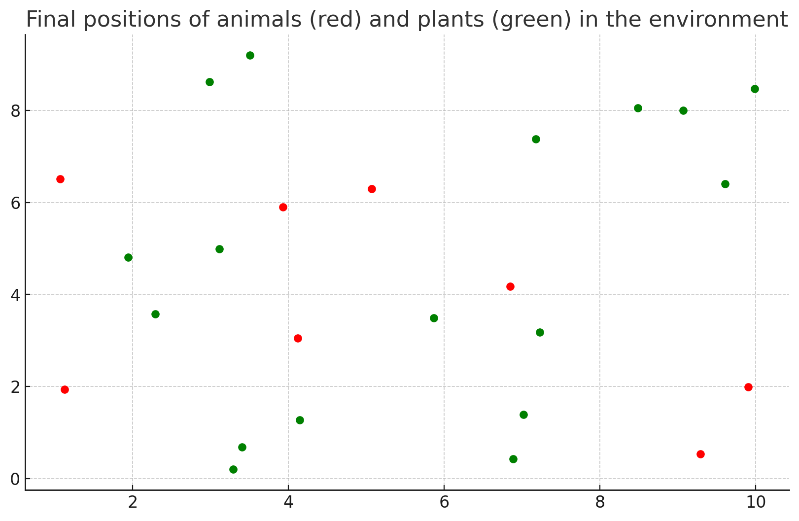

# EcoSim
EcoSim is a Python-based simulation of an ecosystem with plants and animals, showcasing interactions such as hunting and communication. Animals use machine learning (SGDRegressor) to optimize their movements and interactions in response to the environment and communicate the locations of resources and threats

# EcoSim 3d beta 

